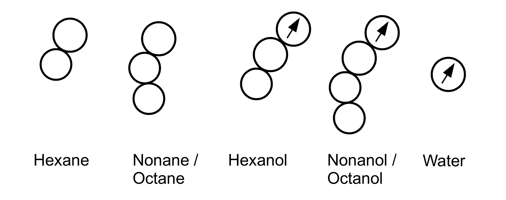

# ELBA coarse-grained solvents

This folder contains pre-equilibrated boxes of coarse-grained (CG) solvents. It contains boxes for the following solvents

For each solvent, there is a Lammps datafile and a PDB-file for easy visualization. The datafile is supposed to be used with the force field parameters in `forcefield.elba `.
