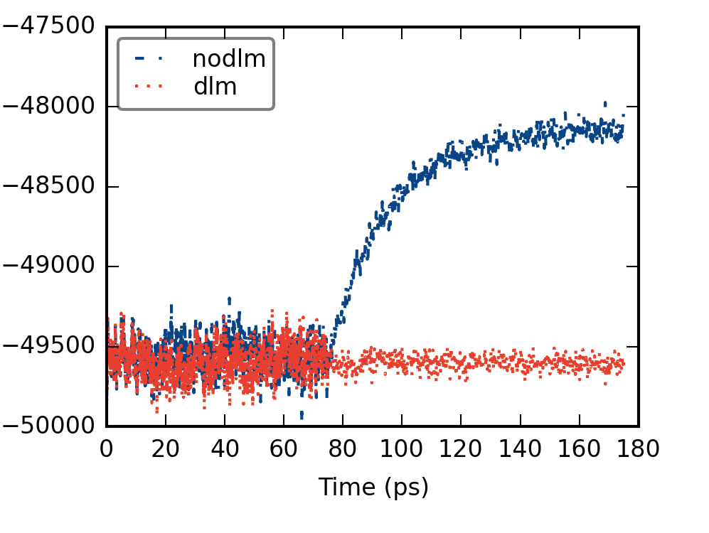
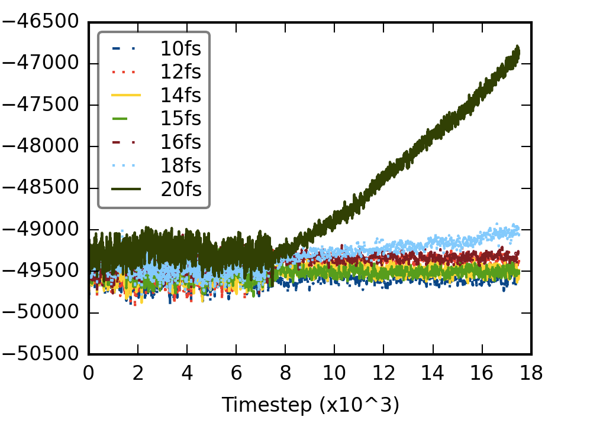

Iain Bethune at EPCC, University of Edinburgh has been implementing new algorithms in the LAMMPS codes.
This blog post describes some of the new capabilities.

A full ARCHER white paper with all the details can be found [here](http://www.archer.ac.uk/documentation/white-papers/lammps-elba/lammps-ecse.pdf).

#### Rotational integration

The existing rotational integrator in LAMMPS for rigid-bodies produced trajectories in the NVE ensemble that did not conserve the total energy. Therefore, the Dullweber-Leimkuhler-McLachlan (DLM) integrator was implemented. This is a good, sympletic and time-reversible integrator, previous implemented in the BRAHMS code.

Here is the total energy for a membrane system with 128 DMPC lipids and 40 water/lipid with both the old and DLM integrator.

In the first 75 ps a thermostat is used to equilibrate the system but then it is turned-off, giving a simulation in the NVE ensemble. You can see that without DLM, the energy quickly increases before reaching a new plateau.

The new integrator also allow the integration at longer time scales.

For the membrane system, up to at least 15 fs is alright.

The DLM integrator is implemented as an option to the exisiting LAMMPS integrator fixes so it may be used with NVE, NVT, NPT or NPH simulations.

#### Load balancing in hybrid simulations

The load balancing of LAMMPS has been improved so that parallel performance is not loss too much when the difference between the time steps of the CG-CG and AA-AA forces in the rRESPA propagator.

This was achieved by making it possible to assign different weights to different group of atoms, for the purpose of optimal load balance. For example, an atomistic molecule can be assigned a weight of 4 compared to a CG water bead with a load of 1.

Here is the benchmark of atomistic BPTI (882 atoms) solvated in 6136 ELBA water beads with a time-step ratio of 8:1

Speed-ups vary depending on the computer architecture and type of system. Therefore, it is recommended to run test jobs and try out different weights before setting on a long simulation.

#### Signficance

It is now possible to run ELBA simulations more efficiently, with longer timesteps both in a variety of ensembles. This would make it easier to study for instance phase transitions in membranes.

Furthermore, the hybrid AA/CG technique is now more attractive as it is more computationally efficient. This allows simulations of larger temporal and spatial scales. 
